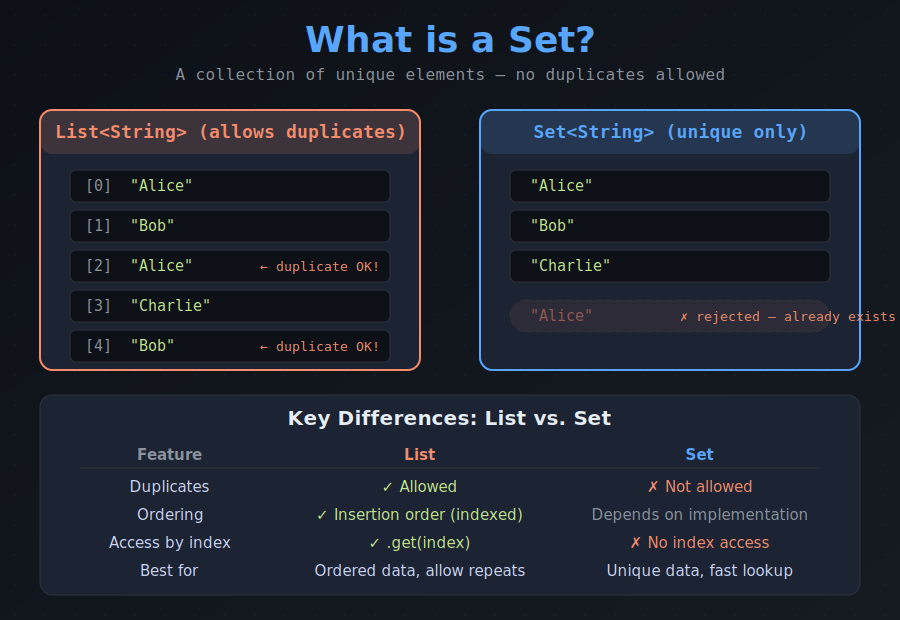
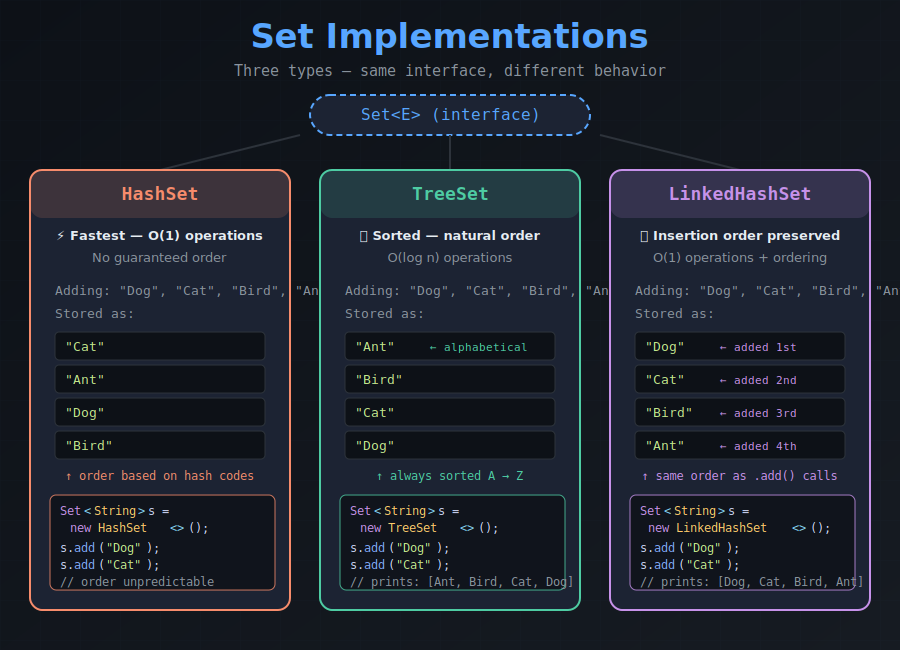
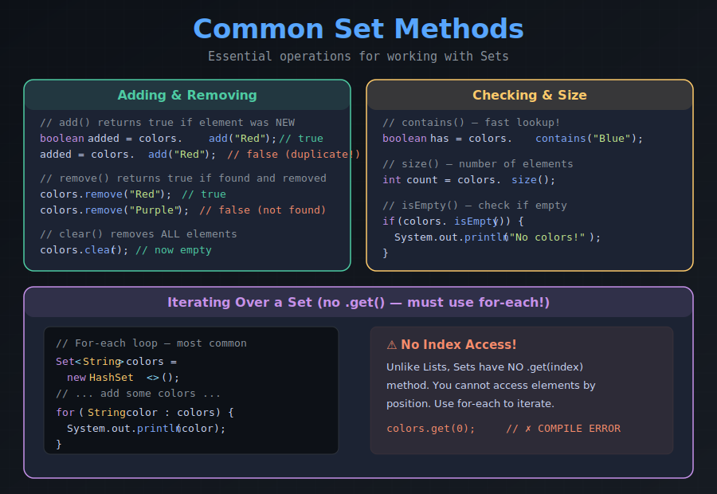
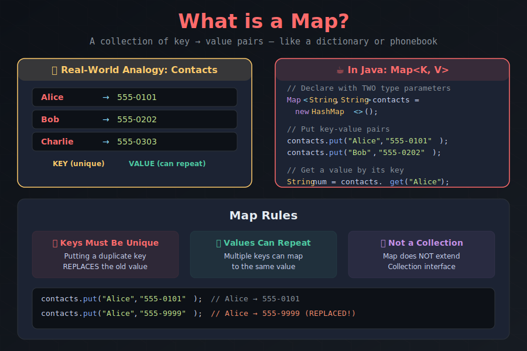
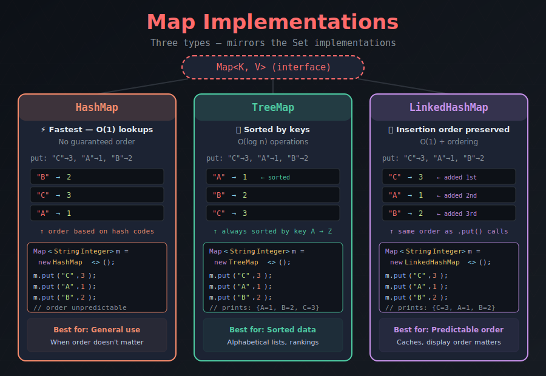
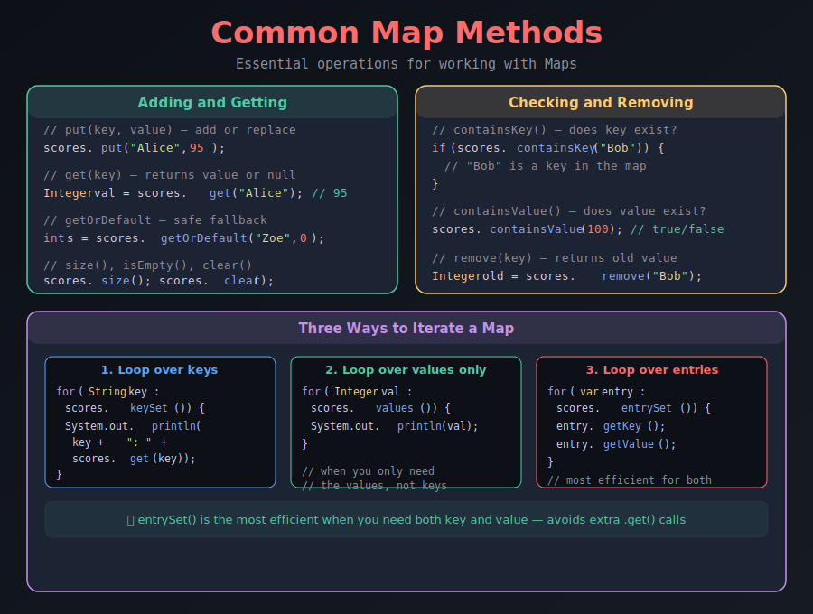
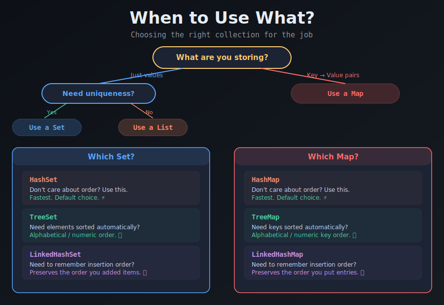

# Java Sets & Maps — Guided Notes

> **Collections Framework** | Unique Collections & Key-Value Pairs

---

## Section 1: What is a Set?



```java
// A Set stores UNIQUE elements — no duplicates
import java.util.HashSet;
import java.util.Set;

Set<String> names = new HashSet<>();
names.add("Alice");
names.add("Bob");
names.add("Alice");  // duplicate — ignored!

System.out.println(names);        // [Alice, Bob]
System.out.println(names.size()); // 2, not 3!
```

> 💡 **Key Takeaway:** A `Set` is like a `List`, but it automatically rejects duplicates. There is **no index access** — you can't call `.get(0)`. Use a for-each loop to iterate.

### ✏️ TODO #1
Create a `Set<String>` of your favorite foods. Try adding a duplicate and print the set to confirm it was rejected.

```java
// TODO #1: Create a HashSet of favorite foods
// Add at least 4 foods, including one duplicate
// Print the set and its size

Set<String> foods = new HashSet<>();

// Add your foods here:


// Print the set and its size:

```

---

## Section 2: HashSet vs TreeSet vs LinkedHashSet



```java
import java.util.*;

// Same data, different behavior
Set<String> hash    = new HashSet<>();
Set<String> tree    = new TreeSet<>();
Set<String> linked  = new LinkedHashSet<>();

// Add in same order to all three
for (String animal : List.of("Dog", "Cat", "Bird", "Ant")) {
    hash.add(animal);
    tree.add(animal);
    linked.add(animal);
}

System.out.println("HashSet:       " + hash);    // unpredictable order
System.out.println("TreeSet:       " + tree);    // [Ant, Bird, Cat, Dog]
System.out.println("LinkedHashSet: " + linked);  // [Dog, Cat, Bird, Ant]
```

### ✏️ TODO #2
Create a `TreeSet<Integer>` and add the numbers 50, 10, 30, 20, 40 in that order. Print the set. What order do they appear in?

```java
// TODO #2: Create a TreeSet of Integers
// Add: 50, 10, 30, 20, 40
// Print the set — what order are they in?

Set<Integer> numbers = new TreeSet<>();

// Add your numbers here:


// Print:


// Answer: The numbers are in ____________ order because TreeSet ____________.
```

---

## Section 3: Common Set Methods



```java
Set<String> colors = new HashSet<>();
colors.add("Red");
colors.add("Blue");
colors.add("Green");

// Check membership — very fast with HashSet!
System.out.println(colors.contains("Red"));    // true
System.out.println(colors.contains("Yellow")); // false

// Remove
colors.remove("Blue");
System.out.println(colors);  // [Red, Green]

// Iterate with for-each (ONLY way — no .get()!)
for (String c : colors) {
    System.out.println("Color: " + c);
}
```

### ✏️ TODO #3
Create a `Set<String>` of class subjects. Add 5 subjects, remove one, check if "Math" is in the set, and iterate to print each subject on its own line.

```java
// TODO #3: Create a Set of class subjects
Set<String> subjects = new HashSet<>();

// Add 5 subjects:


// Remove one subject:


// Check if "Math" is in the set and print the result:


// Use a for-each loop to print each subject:

```

---

> 🦵 **Leg Stretch & Q/A — 5 minutes**
>
> Stand up, stretch, ask questions about Sets before we move on to Maps!

---

## Section 4: What is a Map?



```java
import java.util.HashMap;
import java.util.Map;

// Map<KeyType, ValueType>
Map<String, String> contacts = new HashMap<>();

contacts.put("Alice", "555-0101");
contacts.put("Bob",   "555-0202");

// Get a value by its key
String number = contacts.get("Alice");  // "555-0101"

// Duplicate key REPLACES the old value!
contacts.put("Alice", "555-9999");
System.out.println(contacts.get("Alice"));  // "555-9999"
```

> ⚠️ **Watch Out:** Keys must be unique in a Map. If you `put()` a key that already exists, the old value is *silently replaced*.

### ✏️ TODO #4
Create a `Map<String, Integer>` that maps student names to their ages. Add at least 3 entries, then retrieve and print one student's age using `.get()`.

```java
// TODO #4: Create a Map of student names → ages
Map<String, Integer> ages = new HashMap<>();

// Add at least 3 students with their ages:


// Retrieve and print one student's age:

```

---

## Section 5: HashMap vs TreeMap vs LinkedHashMap



```java
Map<String, Integer> hashMap   = new HashMap<>();
Map<String, Integer> treeMap   = new TreeMap<>();
Map<String, Integer> linkedMap = new LinkedHashMap<>();

// Add same data to all three
String[] names = {"Charlie", "Alice", "Bob"};
int[] scores = {85, 92, 78};

for (int i = 0; i < names.length; i++) {
    hashMap.put(names[i], scores[i]);
    treeMap.put(names[i], scores[i]);
    linkedMap.put(names[i], scores[i]);
}

System.out.println("HashMap:       " + hashMap);   // unpredictable
System.out.println("TreeMap:       " + treeMap);   // {Alice=92, Bob=78, Charlie=85}
System.out.println("LinkedHashMap: " + linkedMap); // {Charlie=85, Alice=92, Bob=78}
```

### ✏️ TODO #5
Create a `TreeMap<String, String>` mapping country names to their capitals. Add at least 4 entries. Print the map — are the entries in alphabetical order by country?

```java
// TODO #5: Create a TreeMap of countries → capitals
Map<String, String> capitals = new TreeMap<>();

// Add at least 4 country-capital pairs:


// Print the map:


// Answer: The entries are sorted by ____________ because TreeMap ____________.
```

---

## Section 6: Common Map Methods



```java
Map<String, Integer> scores = new HashMap<>();
scores.put("Alice", 95);
scores.put("Bob", 82);
scores.put("Charlie", 91);

// Check before accessing
if (scores.containsKey("Bob")) {
    System.out.println("Bob's score: " + scores.get("Bob"));
}

// Safe fallback with getOrDefault
int zoeScore = scores.getOrDefault("Zoe", 0);  // 0 (not found)

// Iterate with entrySet — gets both key and value
for (var entry : scores.entrySet()) {
    System.out.println(entry.getKey() + ": " + entry.getValue());
}
```

### ✏️ TODO #6
Using your `ages` Map from TODO #4 (or create a new one), practice these Map methods:

```java
// TODO #6: Practice Map methods

// a) Check if a specific student exists using containsKey:


// b) Use getOrDefault to safely look up a student that
//    may not exist (use 0 as the default):


// c) Remove one student from the map:


// d) Use a for-each with entrySet() to print each
//    student's name and age on its own line:

```

---

## Section 7: When to Use What?



```java
// Scenario 1: Track unique visitors to a website
Set<String> visitors = new HashSet<>();
visitors.add("user123");
visitors.add("user456");
visitors.add("user123");  // same user, not counted twice
System.out.println("Unique visitors: " + visitors.size());

// Scenario 2: Count word frequency in a sentence
Map<String, Integer> wordCount = new HashMap<>();
String[] words = {"the", "cat", "sat", "on", "the", "mat"};
for (String word : words) {
    wordCount.put(word, wordCount.getOrDefault(word, 0) + 1);
}
System.out.println(wordCount);  // {mat=1, the=2, sat=1, cat=1, on=1}
```

> 💡 **The getOrDefault Pattern:** `map.put(key, map.getOrDefault(key, 0) + 1)` is extremely common for counting occurrences.

### ✏️ TODO #7
Write a small program that counts how many times each character appears in your first name using a `Map<Character, Integer>` and the getOrDefault pattern.

```java
// TODO #7: Count character frequency in your name
String name = "YourNameHere";  // ← replace with your name
Map<Character, Integer> charCount = new HashMap<>();

// Loop through each character of your name
// Hint: use name.charAt(i) to get each character
for (int i = 0; i < name.length(); i++) {
    char c = name.charAt(i);
    // Use getOrDefault pattern to count:

}

// Print the character counts:

```

---

## 🎫 Exit Ticket

**1.** What is the most important thing you learned today about Sets and/or Maps?

> *Write your answer here...*

**2.** What is one thing that is still unclear or that you'd like more practice with?

> *Write your answer here...*

**3.** If you were building an app to track student attendance (just whether they showed up or not on a given day), would you use a `Set` or a `Map`? Why?

> *Write your answer here...*

---

## 📤 Submission (5 points)

1. Push your completed guided notes project to GitHub
2. Make sure the repository is set to **Public**
3. Copy the repository URL
4. Submit the link on Canvas